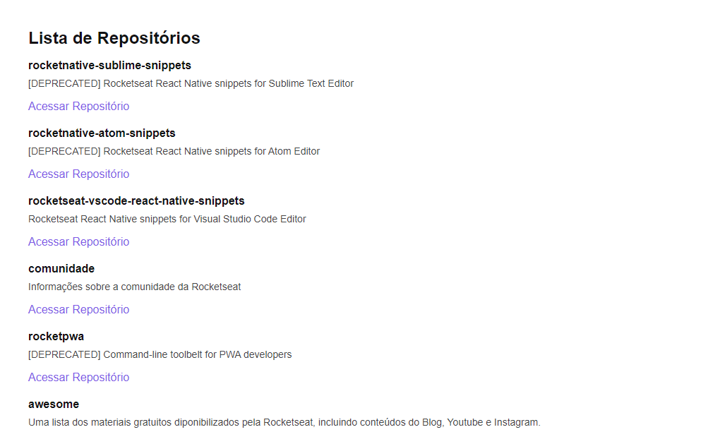

# Ignite - ReactJS

This is my journey from begginer to pro with the help of Rocketseat's course: Ignite - ReactJS

## Module 01 - Github Explorer

In this module, we'll see the basics of React (like Components, States and Properties) and make a simple project that will list some GitHub Repositories

## Module 02 - DT Money (coming soon)
